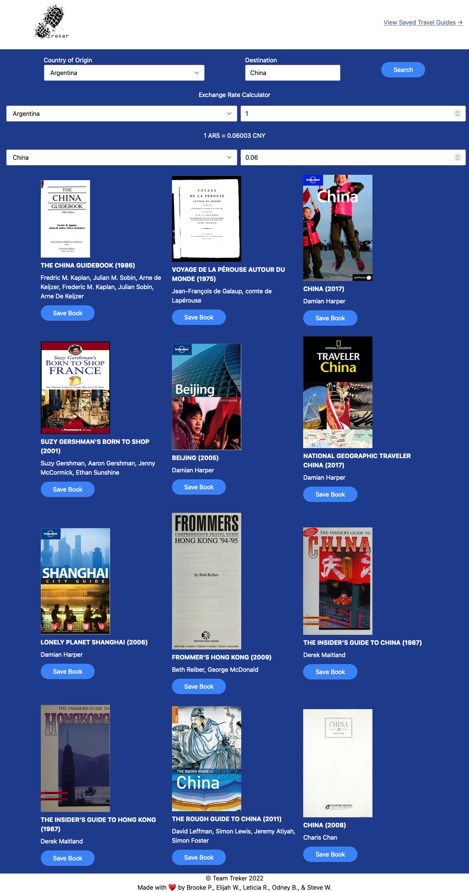

# Treker

## Description

Treker is an application designed for people who are looking to travel abroad. It provides the user with the current currency exchange rate at a one-to-one exchange and guidebooks relevant to their destination. Users can save any guidebooks that they like.

Our motivation was to fill a niche for overseas travelers who are looking to plan their trip beyond just hotels, flights, and rental cars. Travelers need to visit multiple sites to get the currency exchange and look for guidebooks, and we wanted to be able to find all of that information in one place.

## Usage

Enter your country of origin and your destination. Your destination can be a city, state, or country -- or a mix of any of the three! Adjust the currency options based on your preferences and click the 'Search' button.

If you see a guidebook that you like, click the 'Save Book' button! Your saved guidebooks can be accessed by clicking on the 'View Saved Travel Guides' link at the top of the page.

## Technologies Used

- HTML5
- Tailwind CSS v3
- Vanilla JavaScript
- APIs
  - [ExchangeRate-API](https://www.exchangerate-api.com/)
  - [OpenLibrary](https://openlibrary.org/)
  - [OpenCage Geocoding](https://opencagedata.com/)

## Live Site

[Treker](https://brookescodestuff.github.io/treker/)

## Screenshot

